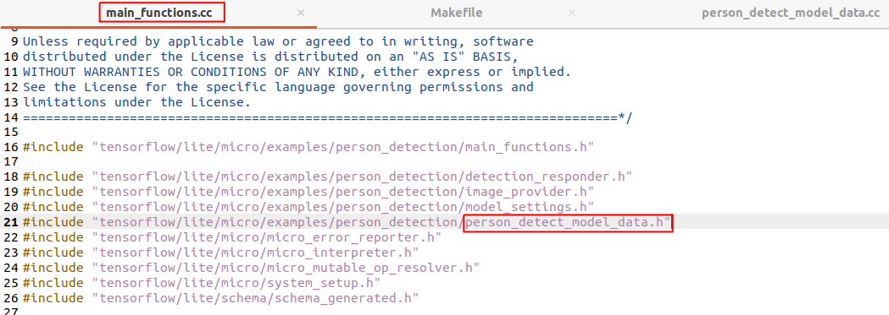
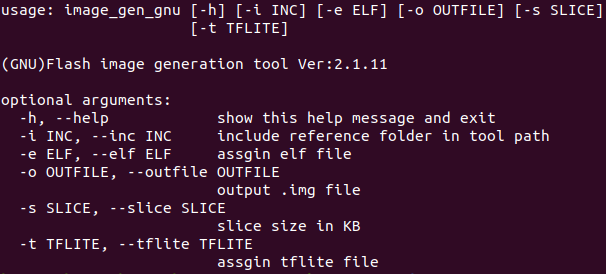

# HIMAX WE1 EVB SDK

HIMAX WE1 EVB SDK provides functionality for HIMAX WE1 EVB, we will describe more detail here for some complicated case. 


## Table of contents

- [HIMAX WE1 EVB SDK](#himax-we1-evb-sdk)
  - [Table of contents](#table-of-contents)
  - [LIB version API](#lib-version-api)
  - [FLASH API](#flash-api)


## LIB version API

| API name  | support SDK version  | 
|:----:|:----:|
| hx_drv_lib_version  | all |

This is the api use to check SDK version.

## FLASH API

| API name  | support SDK version  | support image gen version |
|:----:|:----:|:----:|
| hx_drv_flash_init  | v19+ | v2_1_11+ |
| hx_drv_flash_get_Model_address | v19+ | v2_1_11+ |

These two apis currently are related to TensorFlow Lite for Microcontrollers graph stored in the flash. For example, in the person detection example 
`main_function.cc` file, model is included with corresponding `person_detect_model_data.cc` file and `person_detect_model_data.h` file

 

model will be loaded in the SRAM during inference. Depend on your use case, model data can be pulled out of the SRAM if memory area is not enough for use.

To make model loaded from flash, following are the steps:

1. prepare ypur model `tflite` file and make sure model data is not loaded in the `cc` file 
2. in your example, call `hx_drv_flash_init()` to initial flash and assign model address `hx_drv_flash_get_Model_address()` in flash for tflite::GetModel
```cpp
void setup() {
  //...
  if (hx_drv_flash_init() != HX_DRV_LIB_PASS){
      //flash init fail
      return ;
  }

  //get model (.tflite) from flash
  model = tflite::GetModel((unsigned char*)hx_drv_flash_get_Model_address());
  //...
}

```

3. build your project and get `elf` file
4. copy `elf` file, `map` fie and related `tflite` file to `image_gen_linux` folder 
5. goto `image_gen_linux` folder and export this folder to PATH
```
export PATH=$PATH:$(pwd)
```

6. generate flash image with `tflite` file assign to `-t` parameter and <span style="font-weight:bold;">1024</span> to `-s` parameter. 
`-s` parameter cuts flash image into serveral pieces once reach the given parameter KB size. We use xmodem for flash image Update which support maximum size for each file is 1024KB 



, for example, when elf is built by `GNU` toolchain 
```
./image_gen_gnu -e yolo.elf -t himax_dataset_yolo.tflite -s 1024
```

when elf is built by `MetaWare` toolchain
```
./image_gen -e yolo.elf -m yolo.map -t himax_dataset_yolo.tflite -s 1024
```

7. update flash image to HIMAX WE1 EVB, or check [here](https://github.com/HimaxWiseEyePlus/bsp_tflu/tree/master/HIMAX_WE1_EVB_user_guide#flash-image-update-at-linux-environment) for more information