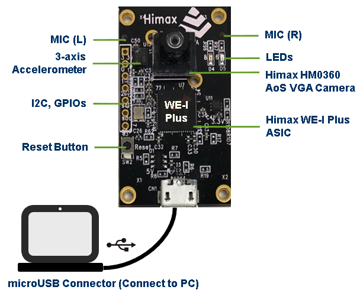

#  HIMAX WE1 EVB  

This document contains the general information of HIMAX WE1 EVB.

======

 (Board size: 40mm x 27mm)   
 Deploy all Google TFLu examples in one board ! 
======

## Himax WE-I Plus MCU

- ARC 32-bit EM9D DSP
- Max. 400MHz clock frequency
- 2MB SRAM
- 2MB Flash

## On Board

- Himax HM0360 AoSTM VGA camera
- FTDI USB to SPI/I2C/UART bridge
- LDO power supply (3.3/2.8/1.8/1.2V)
- 3-axis accelerometer
- 1x reset button
- 2x microphones (L/R)
- 2x user LEDs (RED/GREEN)
- microUSB connector

## Expansion Header

- 1x I2C
- 3x GPIOs
- Power/Ground

## microUSB Connector (Connect to PC)

- Flash programming
- Output message

## Video demo lonk

Please check [here](https://github.com/HimaxWiseEyePlus/bsp_tflu/blob/master/HIMAX_WE1_EVB_board_brief/VideoLink.md) for more video demo example

You can access [Here](https://www.himax.com.tw/products/intelligent-sensing/always-on-smart-sensing/) for more information
and conatact [Himax](https://www.himax.com.tw/products/intelligent-sensing/always-on-smart-sensing/inquiry-form/)
