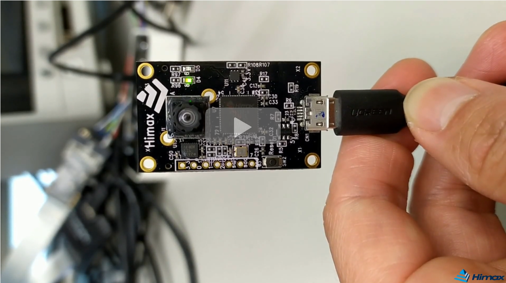
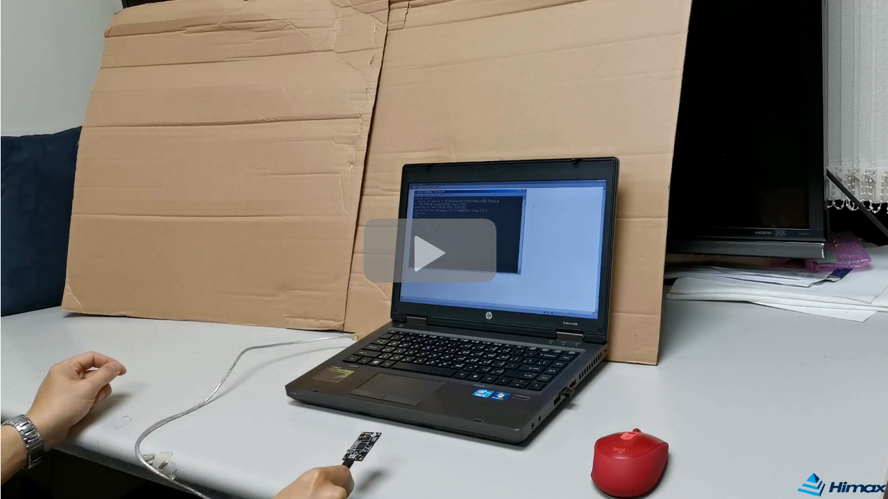
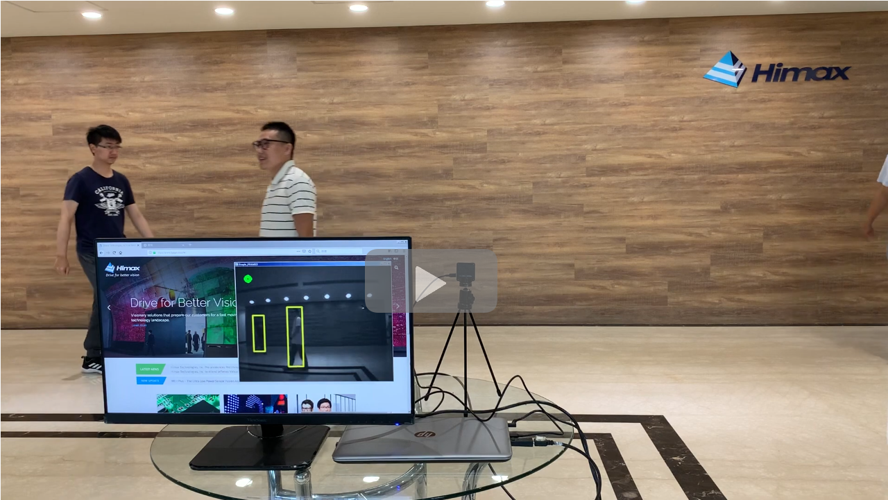

#   Related Video demo link of HIMAX WE1 EVB   

## Google TFLu Person Detection example

## Google TFLu Micro Speech example

## Google TFLu Magic Wand example

## Himax Person Detection with bounding box

## Edge Impulse/Himax Webinar

