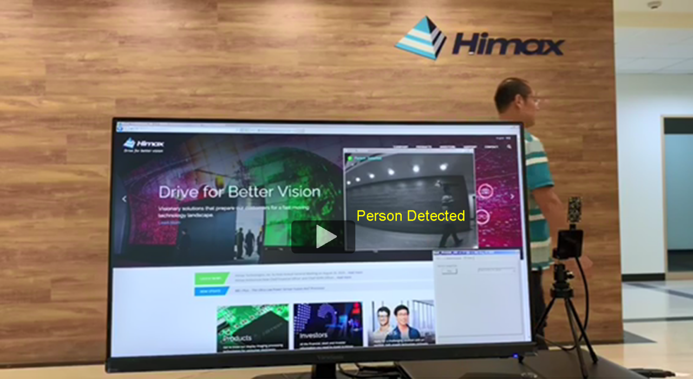
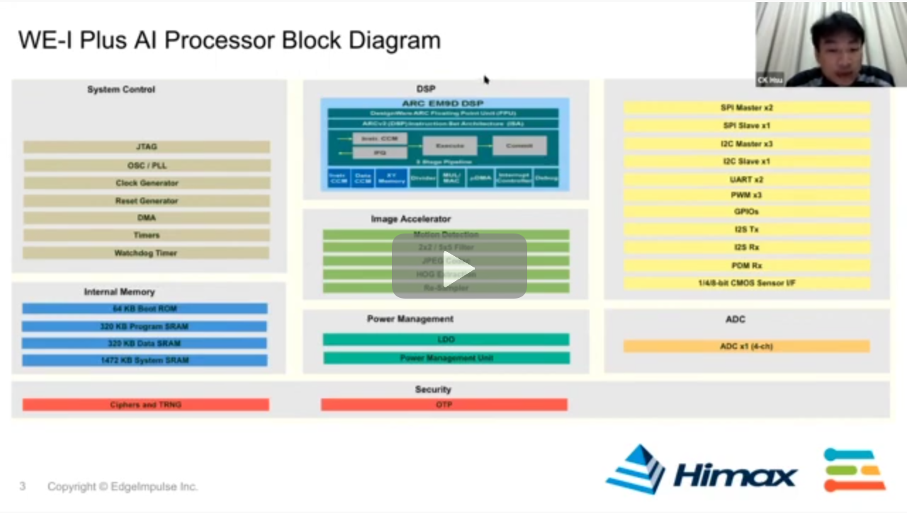

#   Related Video demo link about HIMAX WE1 EVB   

## Table of contents

- Demo Videos
  - [TensorFlow Lite Micro - Person detection](#google-tflu-person-detection-example)
  - [TensorFlow Lite Micro - Micro speech](#google-tflu-micro-speech-example)
  - [TensorFlow Lite Micro - Magic wand](#google-tflu-magic-wand-example)
  - [Himax - Person detection with bounding box](#himax-person-detection-with-bounding-box)

- Webinars
  - [AI Vision and Sensor Fusion with Himax & Edge Impulse](#edge-impulsehimax-webinar)

## Google TFLu Person Detection example

## Google TFLu Micro Speech example

## Google TFLu Magic Wand example

## Himax Person Detection with bounding box

## Edge Impulse/Himax Webinar

