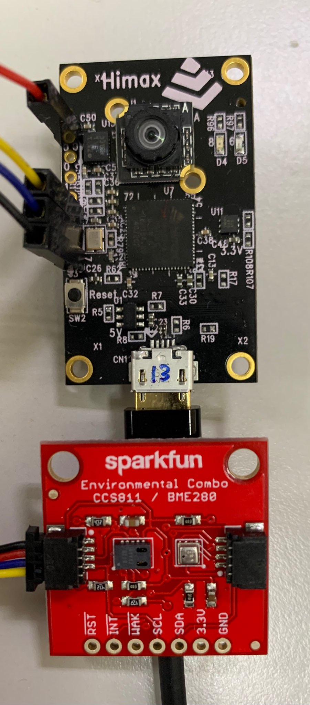

# HIMAX WE1 EVB Example 

HIMAX WE1 EVB supports rich of peripheral interfaces, here we will display usage of them. 

## Table of contents
  - [Prerequisites](#prerequisites)
  - [QWIIC example](#qwiic-example)

## Prerequisites
  - Make Tool and build environment setting
    - Please check [here](https://github.com/HimaxWiseEyePlus/himax_tflm#prerequisites) to prepare the environment to build the examples.
    - Download related third party data (only need to download once)
      ```bash
      make download
      ```
    - Default building toolchain in makefile is Metaware Development toolkit, if you are trying to build example with GNU toolkit. please change the `ARC_TOOLCHAIN` define in `Makefile` like this
      ```
      #ARC_TOOLCHAIN ?= mwdt
      ARC_TOOLCHAIN ?= gnu
      ```
  - Flash image update
    - Please check [here](https://github.com/HimaxWiseEyePlus/bsp_tflu/tree/master/HIMAX_WE1_EVB_user_guide#flash-image-update-at-linux-environment) to prepare the environment for updating the flash image file to HIMAX WE1 EVB.
  
## QWIIC example

[SparkFun's Qwiic System](https://www.sparkfun.com/qwiic) includes sensors, LCDs, relays and more. HIMAX WE1 EVB is able to interactive with them via I2C connection. HIMAX WE1 EVB I2C pin define can be found at <a href="../HIMAX_WE1_EVB_user_guide/docs/HIMAX_WE1_EVB_board_sch.pdf" target="_blank">Board Schematic PDF</a> connector `J3`

<p align="left" class="half">
  
</p>


| QWIIC       |       |          |
| :---------- | :---: | :------: |
| Red line    | 3.3V  | J3 Pin 1 |
| Black line  |  GND  | J3 Pin 7 |
| Yellow line |  SCL  | J3 Pin 5 |
| Blue line   |  SDA  | J3 Pin 6 |

Examples for all qwiic sensors:
| Example             |                                                    |
| :------------------ | :------------------------------------------------: |
| qwiic_ms8607        |    [link](scenario_app/qwiic_ms8607/README.md)     |
| qwiic_ccs811_bme280 | [link](scenario_app/qwiic_ccs811_bme280/README.md) |

- MS8607 Sensor
  MS8607 is a Pressure/Humidity/Temp (PHT) Sensor, you can access [here](https://www.sparkfun.com/products/16298) for more information.
  <p align="left">
    
  </p>
  

- CCS811/BME280 Sensor
  Environmental Combo Breakout providing CO2 (or eCO2) in the parts per million (PPM) and humidity, temperature and barometric pressure data, you can access [here](https://www.sparkfun.com/products/14348) for more information.
  <p align="left">
    
  </p>
  