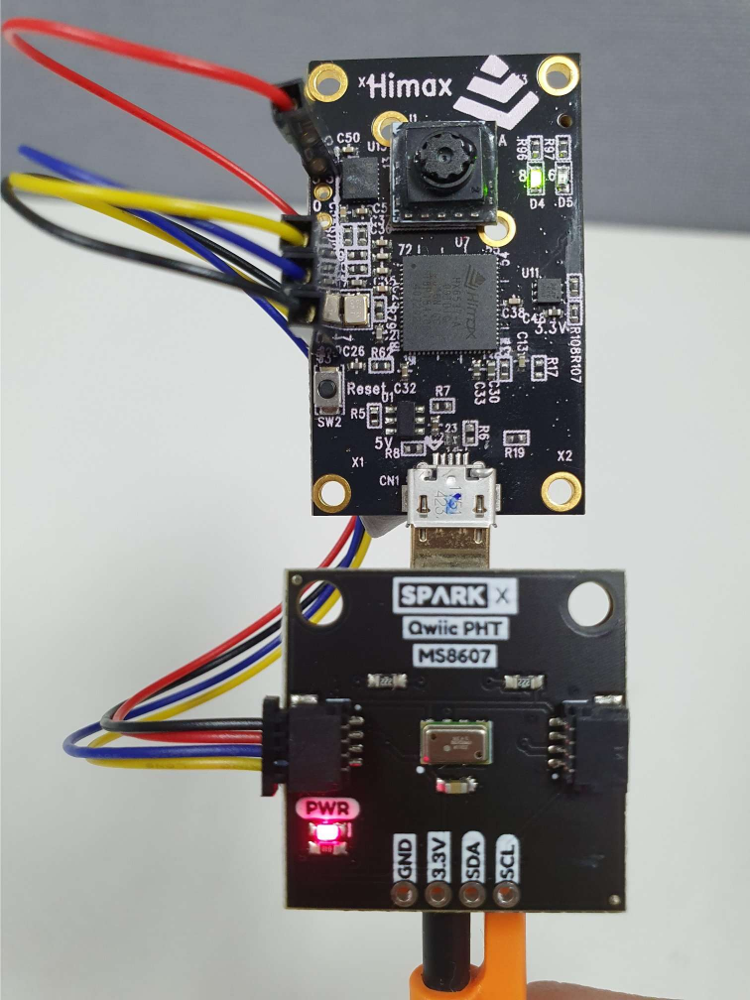

# HIMAX WE1 EVB Example 

HIMAX WE1 EVB supports rich of peripheral interfaces, here we will display usage of them. 

## Table of contents
  - [QWIIC example](#qwiic-example)

   
## QWIIC example

[SparkFun's Qwiic System](https://www.sparkfun.com/qwiic) includes sensors, LCDs, relays and more. HIMAX WE1 EVB is able to interactive with them via I2C connection. HIMAX WE1 EVB I2C pin define can be found at <a href="docs/HIMAX_WE1_EVB_board_sch.pdf" target="_blank">Board Schematic PDF</a> connector `J3`

|  QWIIC |  |  |
| :------------ |:---------------:| :---------------:|
| Red line | 3.3V | J3 Pin 1 |
| Black line  | GND | J3 Pin 7 |
| Yellow line  | SCL  |J3 Pin 5 |
| Blue line  | SDA  |J3 Pin 6 |

- MS8607 Sensor
  
  MS8607 is a Pressure/Humidity/Temp (PHT) Sensor, you can access [Here](https://www.sparkfun.com/products/16298) for more information. 

  

  After get data from sensor, we can display them on the console.

  

- CCS811/BME280 Sensor

  Environmental Combo Breakout providing CO2 (or eCO2) in the parts per million (PPM) and humidity, temperature and barometric pressure data, you can access [Here](https://www.sparkfun.com/products/14348) for more information. 

  

  After get data from sensor, we can display them on the console.

  

  