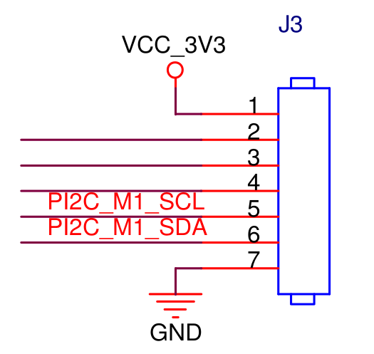

## Person detection with qwiic_ccs811_bme280 and LoRa
The example combine the [qwiic_ccs811_bme280](../qwiic_ccs811_bme280/README.md) sensor and [person detection model](https://github.com/HimaxWiseEyePlus/himax_tflm/tree/master/tensorflow/lite/micro/examples/person_detection_experimental) to detect person. The person detection model only activates when the CO2 value gets from the qwiic_ccs811_bme280 sensor exceeds a given CO2 threshold. If the detection passes, HIMAX WE1 EVB will activate LoRa by software UART and transmit the current environment status.

### Setting
  <p align="left">
  
  </p>

- SparkFun Environmental Combo Breakout - CCS811/BME280 [[ link ]](https://www.sparkfun.com/products/14348)
    - The SparkFun's Qwiic sensors setting can see at [here](../../README.md#qwiic-example)

- LoRa - REYAX RYLR896 [[ Datasheet ]](http://reyax.com.cn/wp-content/uploads/2017/09/RYLR896_EN.pdf)[[ AT COMMAND GUIDE ]](https://reyax.com/wp-content/uploads/2020/01/Lora-AT-Command-RYLR40x_RYLR89x_EN.pdf)
    - HIMAX WE1 EVB GPIO pin define can be found at <a href="../../../HIMAX_WE1_EVB_user_guide/docs/HIMAX_WE1_EVB_board_sch.pdf" target="_blank">Board Schematic PDF</a> connector `J3`

    <p align="left" class="half">
    
    </p>

    | LoRa        |                    |          |
    | :---------- | :----------------: | :------: |
    | Red line    |        3.3V        | J3 Pin 1 |
    | Black line  |        GND         | J3 Pin 7 |
    | Yellow line | WEI TXD \ LoRa RXD | J3 Pin 2 |
    | Green line  | WEI RXD \ LoRa TXD | J3 Pin 3 |


### Detection Flow
1. Get the CO2 data from qwiic_ccs811_bme280 sensor. If the value >= `CO2_THR`, go to step 2.(`CO2_THR` value can set in `setting.h`)
2. Obtain the image from HIMAX WE1 EVB and input it into the person detection model. If the `person_score` output from the mode >= `PERSON_THR` , go to step 3. (`PERSON_THR` value can set in `setting.h`)
3. Init the LoRa setting and send out the environment status to another LoRa module.

### Build example and flash image
- Build Person detection with qwiic_ccs811_bme280 and LoRa example and flash image. Flash image name will be `co2_person_lora_example.img`.
    ```
    make co2_person_lora_example
    make flash example=co2_person_lora_example
    ```
- After above steps, update `co2_person_lora_example.img` to HIMAX WE1 EVB. In our example, if the detection passes, we send out the environment status gets from the qwiic_ccs811_bme280 sensor. The result of the sender the receiver shows in the following pictures.
  - The the environment status message format
    - has persion(1 for true)|Co2 value|Tempature|humidity|Pressure
  - Sender side(HIMAX WE1 EVB)
    - REYAX RYLR896 ADDRESS=1, CRFOP=7

      
  - Receiver side(Another LoRa module)
    - REYAX RYLR896 ADDRESS=2, CRFOP=7
  
      