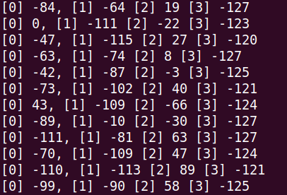

# Edge Impulse project build from C++ library example
Edge Impulse project can be deployed as a C++ library. This example shows how to export the model from your Edge Impulse project, build it with the HIMAX WE1 SDK and deploy it to HIMAX WE1 EVB. 

## Prerequisites
- Development Toolkit
  - This example only supports GNU Development Toolkit. Please check the GNU Development Toolkit chapter [here](https://github.com/HimaxWiseEyePlus/himax_tflm#prerequisites) to prepare the environment to build the example.
- Download related third party data (only need to download once)
    ```bash
    make -C ../../ download
    ```

## Example Edge Impulse project used for demonstration.
Please check [here](https://docs.edgeimpulse.com/docs) to build your own Edge Impulse project. In this example, we use a Hand Gesture Recognition project to demonstrate. The following shows the outline of the Impulse design in this project.
- Input Image data
  - Image width = 96
  - Image height = 96
- Output features
  - 4 (0,1,2,3)

|0|1|2|3|
|----------|--|--|---|
|[unknow]||||


## Export C++ library to repository
- Head over to your Edge Impulse project, go to `Deployment` page, select `C++ library ` and click `Build` to download the `.zip` file of your project.

- Extract the `.zip` file and copy the `edge-impulse-sdk` and `tflite-model` folders to this example folder, then your folder structure should look like this:
    ```
    bsp_tflu/HIMAX_WE1_EVB_example/scenario_app/edgeimpulse-example/
    |_edge-impulse-sdk
    |_images
    |_tflite-model
    |_main.cc
    |_Makefile
    |_README.md
    ```

## Detection response
You can use the HIMAX WE1 SDK to operate the devices on HIMAX WE1 EVB (UART,GPIO,I2C,LED,...) to make the response to the detection. In this example, we make the response at the `RespondToDetection` function in the `main.cc` file:
```c++
switch (maxindex)
{
  case 0:
      hx_drv_led_off(HX_DRV_LED_GREEN);
      hx_drv_led_off(HX_DRV_LED_RED);
      break;
  case 1:
      // if detect gesture 1, turn on LED GREEN and output 1 to PGPIO_0
      hx_drv_led_on(HX_DRV_LED_GREEN);
      hx_drv_led_off(HX_DRV_LED_RED);
      pgpio_config.gpio_pin = HX_DRV_PGPIO_0;
      pgpio_config.gpio_data = 1;
      pgpio_config.gpio_direction = HX_DRV_GPIO_OUTPUT;
      hx_drv_gpio_set(&pgpio_config);
      break;
    ...
}
```
|case|LED GREEN|LED RED|GPIO|
|----------|--|--|--|
|0|off|off|- |
|1|on|off|HX_DRV_PGPIO_0 = 1 |
|2|off|on|HX_DRV_PGPIO_1 = 1 |
|3|on|on|HX_DRV_PGPIO_2 = 1 |


## Build example and flash image
- Build Edge Impulse example and flash image. Flash image name will be `edgeimpulse_example.img`. 
    ```
    make all
    make flash
    ```
- After above steps, update `edgeimpulse_example.img` to HIMAX WE1 EVB. In our example, we display the output score of each category on the console.

   