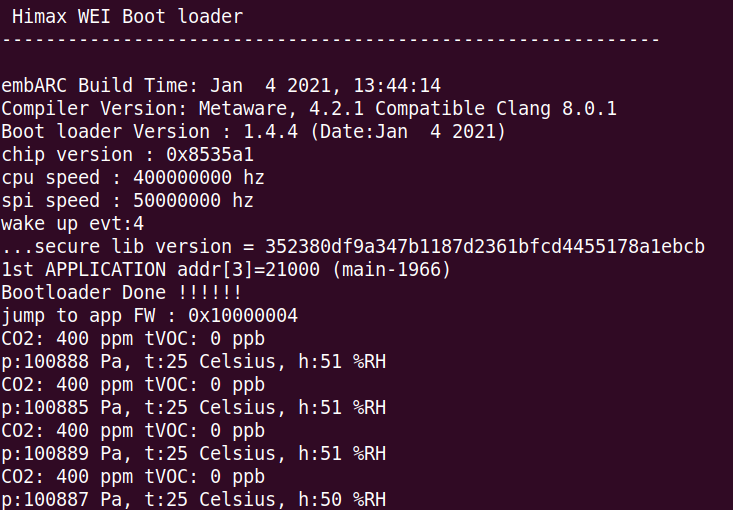

# qwiic_ccs811_bme280 example

- Setting
  <p align="left">
  
  </p>

- Build qwiic_ccs811_bme280 example and flash image. We provide 2 examples to read data from qwiic_ccs811_bme280, you can choose either of them.
  - Example with himax qwiic SDK, detail device initialization will be done by SDK, you can simply call initial and get_data function to retrieve the data. Flash image name will be `qwiic_ccs811_bme280.img`.
    ```bash
    make qwiic_ccs811_bme280
    make flash example=qwiic_ccs811_bme280
    ```
  - Example with himax i2c SDK, directly use SDK i2c master API to initial device and get data back, you can see more detail in the example. Flash image name will be `qwiic_ccs811_bme280_sparkfun.img`.
    ```bash
    make qwiic_ccs811_bme280_sparkfun
    make flash example=qwiic_ccs811_bme280_sparkfun
    ```

- After above steps, update `qwiic_ccs811_bme280.img` to HIMAX WE1 EVB.After get data from sensor, we can display them on the console.

  
