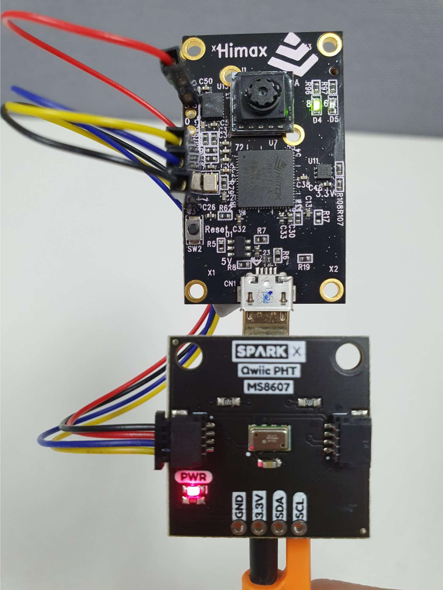
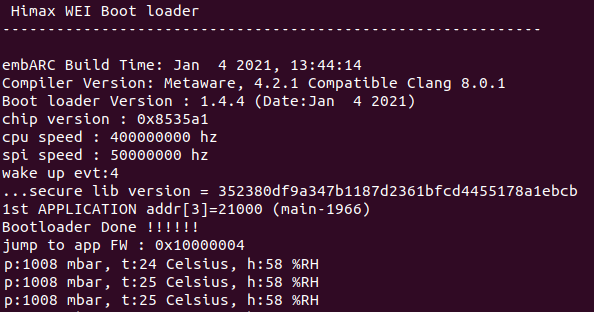

# qwiic_ms8607 example
- Setting
    <p align="left">
    
    </p>

- Build qwiic_ms8607 example and flash image, flash image name will be `qwiic_ms8607.img`.
    ```bash
    make qwiic_ms8607
    make flash example=qwiic_ms8607
    ```

- After above steps, update `qwiic_ms8607.img` to HIMAX WE1 EVB. After get data from sensor, we can display them on the console.
    