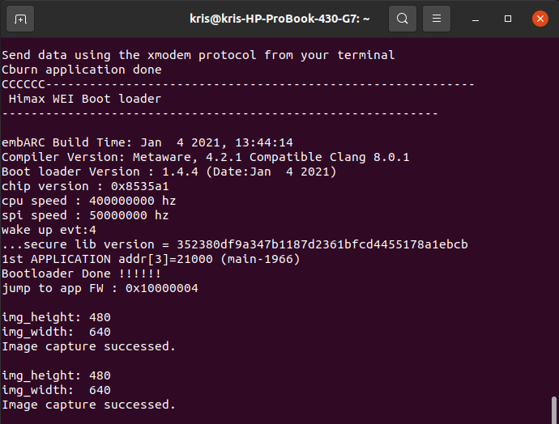
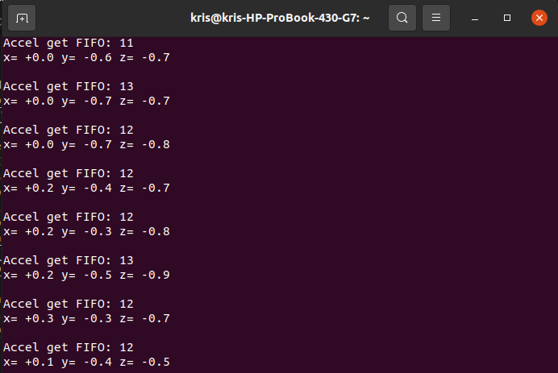
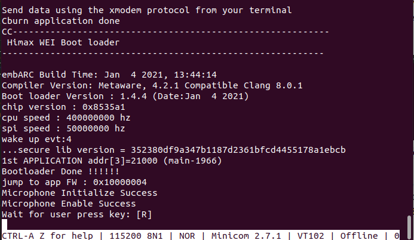
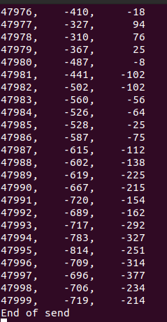

# HIMAX WE1 EVB Workshop Example
It is the basic example with HIMAX SDK for use with HIMAX WE-I Plus Boards. Each example in the package has been tested in Ubuntu 20.04 LTS environment.

Following examples are included :
- capture image example
- accelerometer example
- microphone example
  
## Table of contents
  - [Prerequisites](#prerequisites)
  - [Deploy to Himax WE1 EVB](#deploy-to-himax-we1-evb)
   
## Prerequisites
- Make Tool version
  
  A `make` tool is required for deploying Tensorflow Lite Micro applications, See
[Check make tool version](https://github.com/tensorflow/tensorflow/blob/master/tensorflow/lite/micro/tools/make/targets/arc/README.md#make-tool)
section for proper environment.

- Development Toolkit
  
  Install one of the toolkits listed below:
  
  - MetaWare Development Toolkit

    See
[Install the Synopsys DesignWare ARC MetaWare Development Toolkit](https://github.com/tensorflow/tensorflow/blob/master/tensorflow/lite/micro/tools/make/targets/arc/README.md#install-the-synopsys-designware-arc-metaware-development-toolkit)
section for instructions on toolchain installation.

  - GNU Development Toolkit

    See
[ARC GNU Tool Chain](https://github.com/foss-for-synopsys-dwc-arc-processors/toolchain) section for more detail, current released GNU version is [GNU Toolchain for ARC Processors, 2020.09](https://github.com/foss-for-synopsys-dwc-arc-processors/toolchain/releases/download/arc-2020.09-release/arc_gnu_2020.09_prebuilt_elf32_le_linux_install.tar.gz). After download and extract toolkit to local space, please remember to add it to environment PATH. For example:

    ```
    export PATH=[location of your ARC_GNU_ROOT]/bin:$PATH
    ```

- curl command
  
  Installing curl for Ubuntu Linux.
  ```
  sudo apt update
  sudo apt upgrade
  sudo apt install curl
  ```
- Serial Terminal Emulation Application

  There are 2 main purposes for HIMAX WE1 EVB Debug UART port, print application output and burn application to flash by using xmodem send application binary.

## Deploy to Himax WE1 EVB

The example project for HIMAX WE1 EVB platform can be generated with following command:

Download related third party data (only need to download once)

```
make download
```

Default building toolchain in makefile is Metaware Development toolkit, if you are trying to build example with GNU toolkit. please change the `ARC_TOOLCHAIN` define in `Makefile` like this

```
#ARC_TOOLCHAIN ?= mwdt
ARC_TOOLCHAIN ?= gnu
```

Build capture image example and flash image, flash image name will be `LAB1_capture_image.img`

```
make LAB1_capture_image
make flash example=LAB1_capture_image
```

Build accelerometer example and flash image, flash image name will be `LAB2_accelerometer.img`

```
make LAB2_accelerometer
make flash example=LAB2_accelerometer
```

Build microphone example and flash image, flash image name will be `LAB3_microphone.img`

```
make LAB3_microphone
make flash example=LAB3_microphone
```

After flash image generated, please download the flash image file to HIMAX WE1 EVB by UART, details are described [here](https://github.com/HimaxWiseEyePlus/bsp_tflu/tree/master/HIMAX_WE1_EVB_user_guide#flash-image-update-at-linux-environment)

- After above steps, update `LAB1_capture_image.img` to HIMAX WE1 EVB. In our example, we display the output image size on the console.
  - console
  
  - To see the image you can use SPI_Tool reference [here](https://github.com/HimaxWiseEyePlus/bsp_tflu/tree/master/SPI_Tool#spi-tool-for-receive-meta-data-and-images-from-himax_we1_evb)

- Update `LAB2_accelerometer.img` to HIMAX WE1 EVB. In our example, we display the receive data from 3-axis accelerometer on the console.
  - console
  

- Update `LAB3_microphone.img` to HIMAX WE1 EVB. 
  - In our example, please key-in `R` on the console and it will start to record 3 second and display left and right channel data on the console.
  - console
  
  - show left and right channel data on the console
  