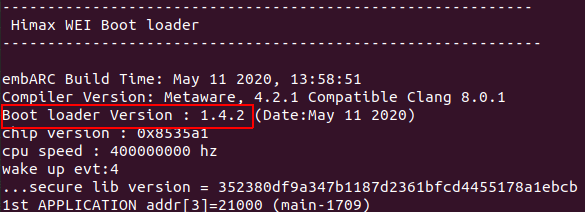
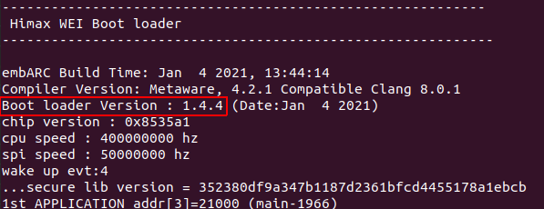
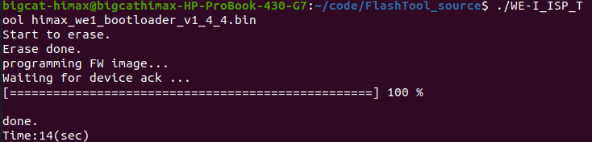
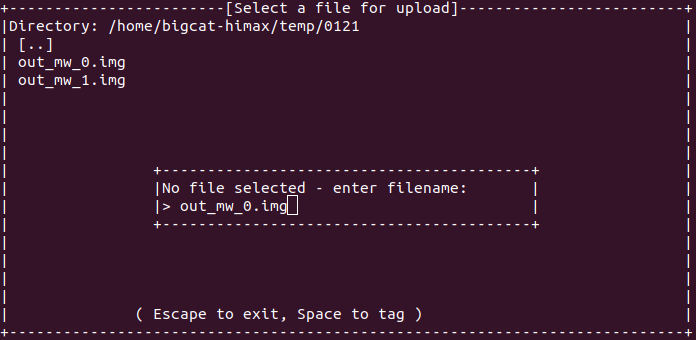
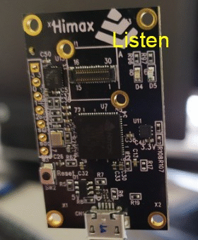
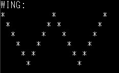
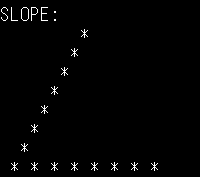

# HIMAX WE1 EVB USER GUIDE

HIMAX WE1 EVB includes Himax WE-I Plus MCU, image sensor and rich peripheral supports. The details are given in the following paragraph. 

HIMAX WE1 EVB now supports to program with Arduino, more details can be found [here](https://github.com/HimaxWiseEyePlus/bsp_tflu/tree/master/HIMAX_WE1_Plus_Arduino#--programming-the-himax-we1-evb-with-arduino--)  


## Table of contents

- [HIMAX WE1 EVB USER GUIDE](#himax-we1-evb-user-guide)
  - [Table of contents](#table-of-contents)
  - [HIMAX WE1 EVB](#himax-we1-evb)
  - [System Requirement](#system-requirement)
    - [Serial terminal emulation application Setting](#serial-terminal-emulation-application-setting)
  - [Flash Image Update](#flash-image-update)
    - [Check Bootloader Version](#check-bootloader-version)
    - [Update Bootloader Version at Linux Environment](#update-bootloader-version-at-linux-environment)
    - [Flash Image Update at Windows Environment](#flash-image-update-at-windows-environment)
    - [Flash Image Update at Linux Environment](#flash-image-update-at-linux-environment)
  - [TensorFlow Lite for Microcontroller example](#tensorflow-lite-for-microcontroller-example)
    - [TFLM Example Hello World](#tflm-example-hello-world)
    - [TFLM Example Person Detection INT8](#tflm-example-person-detection-int8)
    - [TFLM Example Micro Speech INT8](#tflm-example-micro-speech-int8)
    - [TFLM Example Magic Wand](#tflm-example-magic-wand)


## HIMAX WE1 EVB


  1.	Himax WE-I Plus chip
  2.	HM0360 AoS<sup>TM</sup> VGA camera
  3.	Reset Button
  4.	3-Axis Accelerometer
  5.	RED LEDx1 and GREEN LED x1 
  6.	2.54mm Pitch Female Headers for GPIO and I2C
  7.	Microphones (L/R) at back side 

  <a href="docs/HIMAX_WE1_EVB_board_sch.pdf" target="_blank">Board Schematic PDF</a>

## System Requirement
  - HIMAX WE1 EVB
  - Connection cable
    - Micro usb cable: connect to EVB (as Power/UART)

  - Software Tools
    - Serial terminal emulation application
      - In the following description, [TeraTerm](https://ttssh2.osdn.jp/index.html.en) and [Minicom](https://linux.die.net/man/1/minicom) 
        will be used.
    - Flash Binary provided 


### Serial terminal emulation application Setting 

|   |  |
| :------------ |:---------------:|
| Baud Rate  | 115200 bps |
| Data | 8 bit |
| Parity  | none  |
| Stop  | 1 bit  |
| Flow control | none |


  please check xmodem protocol is supported.  
  - TeraTerm support xmodem transfer  
  

  - Minicom will extra install "lrzsz" package to support xmodem protocol  
  


## Flash Image Update

There are bootloader and application in the flash, application update is available via serial terminal at Windows and Linux environment.
  - [Update Flash image at Windows Environment](#flash-image-update-at-windows-environment)
  - [Update Flash image at Linux Environment](#flash-image-update-at-linux-environment)

You can see the generated application flash image name with suffix "_0.img", "_1.img" if image size is larger than 1MB. To support multiple images update, please [check](#check-bootloader-version) and [update](#update-bootloader-version-at-linux-environment) HIMAX WE1 EVB bootloader to v1.4.4 or above. Current bootloader update tool only support Linux environment.

### Check Bootloader Version

1. open terminal at your environment
2. Reset HIMAX WE1 EVB by press reset button, then press any keyboard key (except `enter` key) in 0.3 sec. 
3. check version number displayed at terminal
4. multiple images update is not supported for bootloader version lower than v1.4.4

    `v1.4.2` - don't support multiple images update  
    

    `v1.4.4` - support multiple images update  
    

### Update Bootloader Version at Linux Environment

1. Please notice that following steps will erase all data (bootloader and application) in the HIMAX WE1 EVB flash.
2. Download FT4222 linux driver [here](https://www.ftdichip.com/Support/SoftwareExamples/libft4222-linux-1.4.4.9.tgz).
3. Type `install4222.sh` to install FT4222 driver.
4. Assign access right to usb device, go to deirectory 

    ```
    cd /etc/udev/rules.d/
    ```

    create file with naming `99-ftdi.rules`, fill following data in file

    ```
    # FTDI's ft4222 USB-I2C Adapter
    SUBSYSTEM=="usb", ATTRS{idVendor}=="0403", ATTRS{idProduct}=="601c", GROUP="plugdev", MODE="0666"
    ```

5. Download Flash tool [here](https://github.com/HimaxWiseEyePlus/bsp_tflu/releases/download/v1.0/FlashTool.zip) and unzip it.
6. Download bootloader, current latest version is v1.4.4 [here](https://github.com/HimaxWiseEyePlus/bsp_tflu/releases/download/v1.0/himax_we1_bootloader_v1_4_4.bin). 
7. Copy bootloader to FlashTool directory.
8. Connect HIMAX WE1 EVB via USB cable.
9. Make sure there is no serial terminal connect to HIMAX WE1 EVB
10. Type following command to start update flash image
   
    ```
    ./WE-I_ISP_Tool [bootloader name]
    ```
         
11. For example, download bootloader  `himax_we1_bootloader_v1_4_4.bin` to flash



12. After bootloader updated, you can double check the version by open terminal at your environment and press reset button on HIMAX WE1 EVB.


13. You can then download application to flash by following steps.[(Windows)](#flash-image-update-at-windows-environment) [(Linux)](#flash-image-update-at-linux-environment). 
  
### Flash Image Update at Windows Environment

1. Following steps update application in the flash.
2. Open TeraTerm and select `File -> New connection`, connect to HIMAX WE1 EVB.
3. Reset HIMAX WE1 EVB by press reset button, then press any keyboard key (except `enter` key) in 0.3 sec. boot option will be displayed.


4. Press button `1` and HIMAX WE1 EVB will enter receiving mode after then. Select target flash image by `File->Transfer->XMODEM->Send`. Please start from file name with suffix "_0.img" and then "_1.img" if multiple images. 


5. After "burn application done" message displayed, select next file for update or press reset button to restart.

### Flash Image Update at Linux Environment

1. Following steps update application in the flash.
2. connect HIMAX WE1 EVB with micro usb cable, check device ID by typing  

    ```
     ls /sys/bus/usb-serial/devices/ -ltrah
    ``` 
    
3. Open minicom by typing
    
    ```
    sudo minicom -s
    ```   
  
4. Select `Serial port Setup`, make sure `A - Serial Device` select correct device and `E - Bps/Par/Bits` set to correct value.   

  

4. After finish all setting, press `Esc` button at configuration menu will return to minicom. 
5. Reset WE1 EVB by press reset button, then press any keyboard key (except `enter` key) in 0.3 sec. boot option will be displayed.


6. Press button `1` and WE1 EVB will enter receiving mode after then. Press `Ctrl+A` to enter minicom menu.
7. Press `s` button to upload file and select "xmodem".


8. Fill target flash image path and image name. Please start from file name with suffix "_0.img" and then "_1.img" if multiple images. 



9. Press any key after transfer done.


10. After "burn application done" message displayed on th console, back to step 6 and select another flash image or press reset button to restart.

    


## TensorFlow Lite for Microcontroller example 

  - [TFLM example - hello world](#tflm-example-hello-world)
  - [TFLM example - person detection INT8](#tflm-example-person-detection-int8)
  - [TFLM Example Micro Speech INT8](#tflm-example-micro-speech-int8)
  - [TFLM Example Magic Wand](#tflm-example-magic-wand)

### TFLM Example Hello World

  To generate hello world example flash binary for HIMAX WE1 EVB:
  1. Based on the flow of [hello world example](https://github.com/HimaxWiseEyePlus/tensorflow/tree/master/tensorflow/lite/micro/examples/hello_world#deploy-to-himax-we1-evb) to generate flash image. 
  2. Download image binary to HIMAX WE1 EVB, detail steps can be found at [flash image update](#flash-image-update).
  3. Hello world example message will be shown on the terminal application. 


### TFLM Example Person Detection INT8

  To generate person detection example flash binary for HIMAX WE1 EVB:
  1. Based on the flow of [person detection example](https://github.com/tensorflow/tflite-micro/tree/main/tensorflow/lite/micro/examples/person_detection#person-detection-example) and [Himax person detection example](https://github.com/HimaxWiseEyePlus/himax_tflm#deploy-to-himax-we1-evb) to generate flash image. 
  2. Download image binary to HIMAX WE1 EVB, detail steps can be found at [flash image update](#flash-image-update).
  3. Person detection example message will be shown on the terminal application. 


  4. During Person score > no person score, Green LED will turn on.


### TFLM Example Micro Speech INT8

  To generate micro speech example flash binary for HIMAX WE1 EVB:
  1. Based on the flow of [micro speech example](https://github.com/tensorflow/tflite-micro/tree/main/tensorflow/lite/micro/examples/micro_speech#micro-speech-example) and [Himax micro speech example](https://github.com/HimaxWiseEyePlus/himax_tflm#deploy-to-himax-we1-evb) to generate flash image. 
  2. Download image binary to HIMAX WE1 EVB, detail steps can be found at [flash image update](#flash-image-update).
  3. Micro speech example message will be shown on the terminal application with LED flickering. 

```
    Heard yes (206) @1700ms
    Heard no (201) @4800ms
    Heard unknown (202) @8200ms
    Heard yes (205) @11600ms
```
   

### TFLM Example Magic Wand

  To generate magic wand example flash binary for HIMAX WE1 EVB:
  1. Based on the flow of [magic wand example](https://github.com/tensorflow/tflite-micro/tree/main/tensorflow/lite/micro/examples/magic_wand#magic-wand-example) and [Himax magic wand example](https://github.com/HimaxWiseEyePlus/himax_tflm#deploy-to-himax-we1-evb) to generate flash image. 
  2. Download image binary to HIMAX WE1 EVB, detail steps can be found at [flash image update](#flash-image-update).
  3. Magic wand example message will be shown on the terminal application. 
  4. There are 3 gestures supported in magic wand example. 
   
   
   
   
  
  5. To get better accuracy for retrieve correct gesture on HIMAX WE1 EVB, tweak parameters in constants.h may helps. Following are the setting we test during the example.
    
   


   