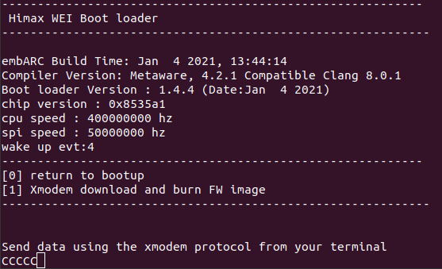
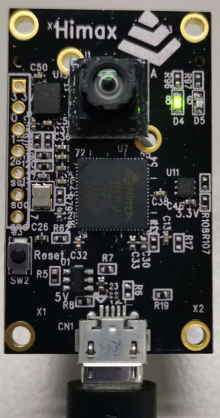
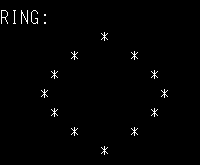
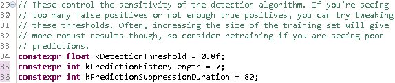

# HIMAX WE1 EVB USER GUIDE

HIMAX WE1 EVB includes Himax WE-I Plus MCU, image sensor and rich peripheral supports. The details are given in the following paragraph.  


## Table of contents

- [HIMAX WE1 EVB USER GUIDE](#himax-we1-evb-user-guide)
  - [Table of contents](#table-of-contents)
  - [HIMAX WE1 EVB](#himax-we1-evb)
  - [System Requirement](#system-requirement)
    - [Serial terminal emulation application Setting](#serial-terminal-emulation-application-setting)
  - [Flash Image Update](#flash-image-update)
    - [Flash Image Update at Windows Environment](#flash-image-update-at-windows-environment)
    - [Flash Image Update at Linux Environment](#flash-image-update-at-linux-environment)
  - [TensorFlow Lite for Microcontroller example](#tensorflow-lite-for-microcontroller-example)
    - [TFLM Example Hello World](#tflm-example-hello-world)
    - [TFLM Example Person Detection INT8](#tflm-example-person-detection-int8)
    - [TFLM Example Micro Speech INT8](#tflm-example-micro-speech-int8)
    - [TFLM Example Magic Wand](#tflm-example-magic-wand)


## HIMAX WE1 EVB


  1.	Himax WE-I Plus chip
  2.	HM0360 AoS<sup>TM</sup> VGA camera
  3.	Reset Button
  4.	3-Axis Accelerometer
  5.	RED LEDx1 and GREEN LED x1 
  6.	2.54mm Pitch Female Headers for GPIO and I2C
  7.	Microphones (L/R) at back side 

  <a href="docs/HIMAX_WE1_EVB_board_sch.pdf" target="_blank">Board Schematic PDF</a>

## System Requirement
  - HIMAX WE1 EVB
  - Connection cable
    - Micro usb cable: connect to EVB (as Power/UART)

  - Software Tools
    - Serial terminal emulation application
      - In the following description, [TeraTerm](https://ttssh2.osdn.jp/index.html.en) and [Minicom](https://linux.die.net/man/1/minicom) 
        will be used.
    - Flash Binary provided 


### Serial terminal emulation application Setting 

|   |  |
| :------------ |:---------------:|
| Baud Rate  | 115200 bps |
| Data | 8 bit |
| Parity  | none  |
| Stop  | 1 bit  |
| Flow control | none |


  please check xmodem protocol is supported.  
  - TeraTerm support xmodem transfer  
  

  - Minicom will extra install "lrzsz" package to support xmodem protocol  
  


## Flash Image Update

  - [Update Flash image at Windows Environment](#flash-image-update-at-windows-environment)
  - [Update Flash image at Linux Environment](#flash-image-update-at-linux-environment)

### Flash Image Update at Windows Environment

1. Open TeraTerm and select `File -> New connection`, connect to HIMAX WE1 EVB.
2. Reset WE1 EVB by press reset button, then press any keyboard key (except `enter` key) in 0.3 sec. boot option will be displayed.


3. Press button `1` and WE1 EVB will enter receiving mode after then. Select target flash image by `File->Transfer->XMODEM->Send`.


4. Press reset button after "burn application done" message displayed.

### Flash Image Update at Linux Environment

1. connect HIMAX WE1 EVB with micro usb cable, check device ID by typing  

    ```
     ls /sys/bus/usb-serial/devices/ -ltrah
    ``` 
    
2. Open minicom by typing
    
    ```
    sudo minicom -s
    ```   
  
3. Select `Serial port Setup`, make sure `A - Serial Device` select correct device and `E - Bps/Par/Bits` set to correct value.   

  

4. After finish all setting, press `Esc` button at configuration menu will return to minicom. 
5. Reset WE1 EVB by press reset button, then press any keyboard key (except `enter` key) in 0.3 sec. boot option will be displayed.



6. Press button `1` and WE1 EVB will enter receiving mode after then. Press `Ctrl+A` to enter minicom menu.
7. Press `s` button to upload file and select "xmodem".


8. Fill target flash image path and image name.


9. Press any key after transfer done.


10. Press reset button after "burn application done" message displayed.

## TensorFlow Lite for Microcontroller example 

  - [TFLM example - hello world](#tflm-example-hello-world)
  - [TFLM example - person detection INT8](#tflm-example-person-detection-int8)
  - [TFLM Example Micro Speech INT8](#tflm-example-micro-speech-int8)
  - [TFLM Example Magic Wand](#tflm-example-magic-wand)

### TFLM Example Hello World

  To generate hello world example flash binary for HIMAX WE1 EVB:
  1. Based on the flow of [hello world example](https://github.com/tensorflow/tensorflow/tree/master/tensorflow/lite/micro/examples/hello_world#hello-world-example) to generate flash image. 
  2. Download image binary to HIMAX WE1 EVB, detail steps can be found at [flash image update](#flash-image-update).
  3. Hello world example message will be shown on the terminal application. 


### TFLM Example Person Detection INT8

  To generate person detection example flash binary for HIMAX WE1 EVB:
  1. Based on the flow of [person detection example](https://github.com/tensorflow/tensorflow/tree/master/tensorflow/lite/micro/examples/person_detection_experimental#person-detection-example) to generate flash image. 
  2. Download image binary to HIMAX WE1 EVB, detail steps can be found at [flash image update](#flash-image-update).
  3. Person detection example message will be shown on the terminal application. 


  4. During Person score > no person score, Green LED will turn on.



### TFLM Example Micro Speech INT8

  To generate micro speech example flash binary for HIMAX WE1 EVB:
  1. Based on the flow of [micro speech example](https://github.com/tensorflow/tensorflow/tree/master/tensorflow/lite/micro/examples/micro_speech#micro-speech-example) to generate flash image. 
  2. Download image binary to HIMAX WE1 EVB, detail steps can be found at [flash image update](#flash-image-update).
  3. Micro speech example message will be shown on the terminal application with LED flickering. 

```
    Heard yes (206) @1700ms
    Heard no (201) @4800ms
    Heard unknown (202) @8200ms
    Heard yes (205) @11600ms
```
   

### TFLM Example Magic Wand

  To generate magic wand example flash binary for HIMAX WE1 EVB:
  1. Based on the flow of [magic wand example](https://github.com/tensorflow/tensorflow/tree/master/tensorflow/lite/micro/examples/magic_wand#magic-wand-example) to generate flash image. 
  2. Download image binary to HIMAX WE1 EVB, detail steps can be found at [flash image update](#flash-image-update).
  3. Magic wand example message will be shown on the terminal application. 
  4. There are 3 gestures supported in magic wand example. 
   
   
   
   
  
  5. To get better accuracy for retrieve correct gesture on HIMAX WE1 EVB, tweak parameters in constants.h may helps. Following are the setting we test during the example.
    
   


   