# <span style="color:lightblue;">  Programming the HIMAX WE1 EVB with Arduino  </span> 

This document contains steps to program HIMAX WE1 EVB with Arduino. To know more the board, Please check [Himax WE1 EVB brief](https://github.com/HimaxWiseEyePlus/bsp_tflu/tree/master/HIMAX_WE1_EVB_board_brief#-himax-we1-evb-) and [Himax WE1 EVB user guide](https://github.com/HimaxWiseEyePlus/bsp_tflu/tree/master/HIMAX_WE1_EVB_user_guide#himax-we1-evb-user-guide).

That's start from the Arduino IDE, make sure it is installed on your machine, if not, please get them from [Arduino website](https://www.arduino.cc/en/Main/Software).

## Installing the WE-I Plus Boards Package

1. In Arduino IDE, open `File->Preferences`.
   
    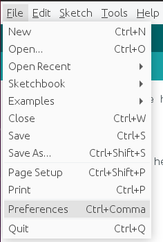

2. Find `Additional Boards Manager URLs` and enter additional URLs.
    ```
     https://raw.githubusercontent.com/HimaxWiseEyePlus/bsp_tflu/master/HIMAX_WE1_Plus_Arduino/IDE_Board_Manager/package_WE-I_Plus_index.json
    ```
    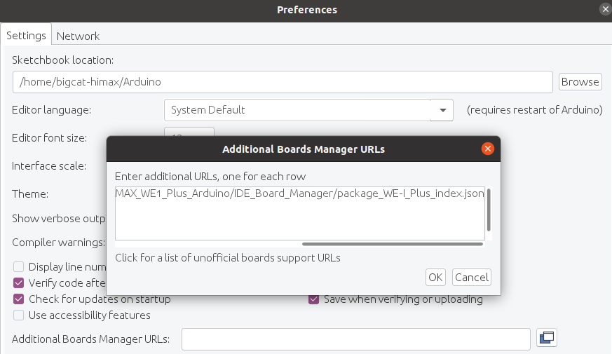

3. Select `OK` button. 
4. After additional URL setting in the preferences, check boards manager by `Tools->Board->Boards Manager`.
   
   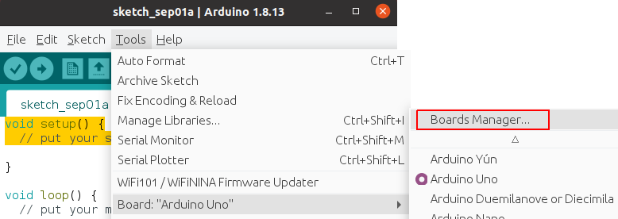

5. Search keyword `WE-I` in boards manager and install WE-I Plus Board package.

    


## Running the Examples

Plug HIMAX WE-I EVB to USB port and Let's go

1. To upload examples to WE-I EVB, we need to select WE-1 EVB first. Open `Tools->Board->WE-I Plus Boards->WE-I EVB`.

    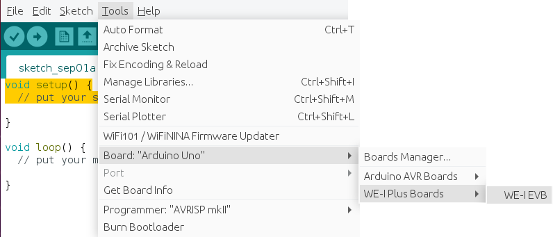

2. Serial port is used with upload speed `115200`, select target port (ubuntu) /dev/ttyUSBx.

    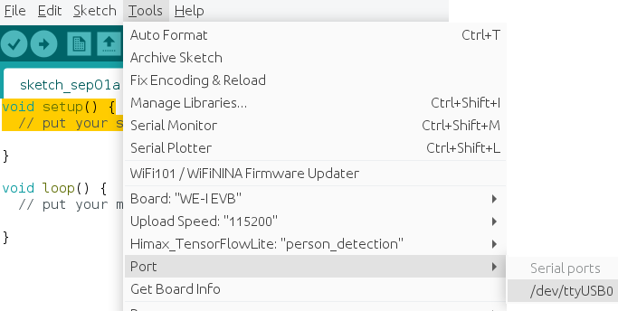

3. (Ubuntu) If you see this message, please add permission for serial port. 

    
4. Follows steps in Arduino [link](https://www.arduino.cc/en/Guide/Linux) to add serial permission, maybe reboot is needed after permission added.

    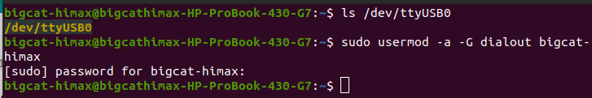

5. Select example to upload. Open `Tools->HimaxTensorFlowLite:` and select target example.

    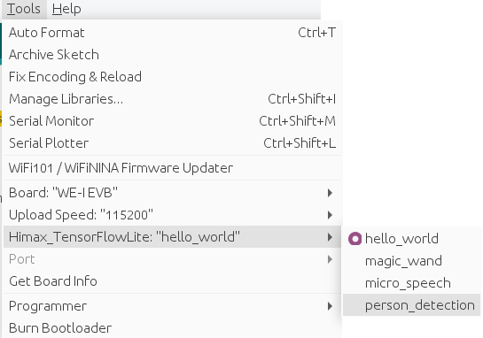

6. Press `upload` button to upload example image, follows the indication to press reset button on the HIMAX WE-I EVB.

    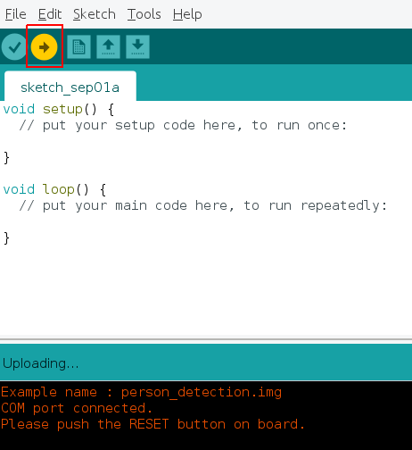

7. There is a progress bar and example name during upload, after it goes to 100%, upload procedure is done. 

    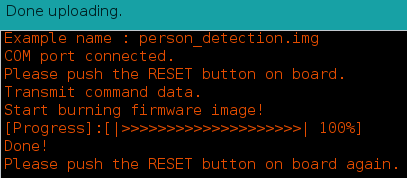
   
8. Press reset button on HIMAX WE-I EVB again to run the example, please check serial port for more related message 

    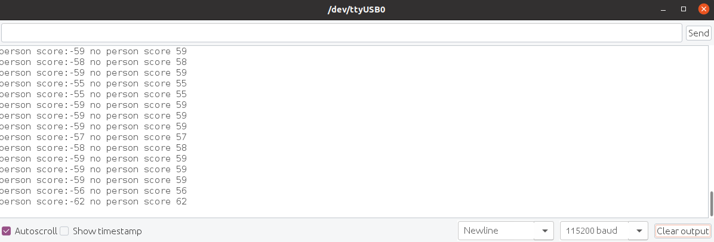


## Examples - Hello World

After upload and run example - hello_world, you can see sine function output in serial port

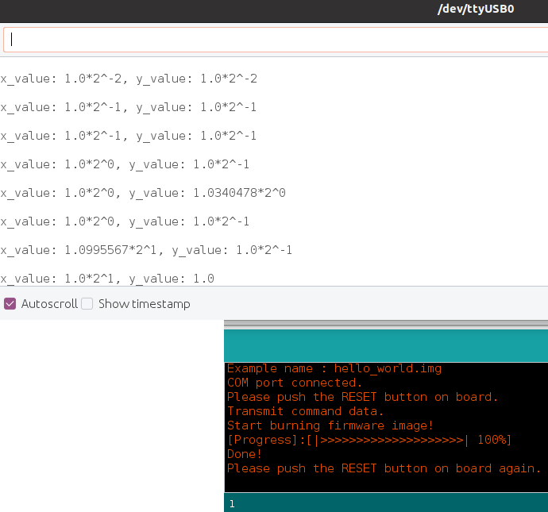

## Examples - Magic Wand

After upload and run example - magic_wand, try to perform following gestures `Wing`,`Ring`,`Slope` and you can see the otuput in serial terminal.
 
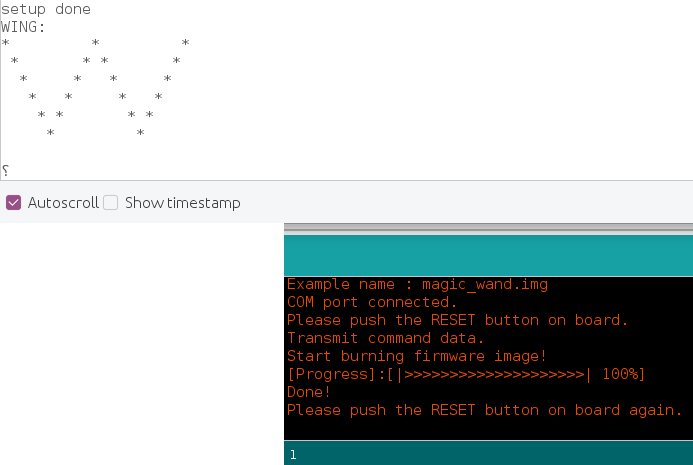

## Examples - Micro Speech

After upload and run example - micro_speech, try to say `yes` or `no` command and you can see the otuput in serial terminal.
 
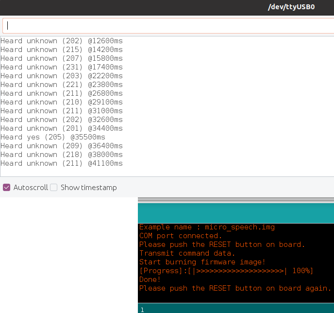

There is LED indication of `Listen` and result indication of `yes` or `no`.


## Examples - Person Detection

After upload and run example - person_detection, there will be a LED indication when person is in front of image sensor, you can also check serial port for the score information.
 
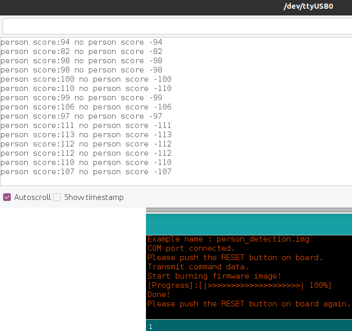
