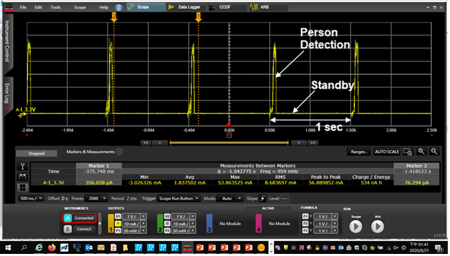

#   Power measuremnt of HIMAX WE-1 Plus   

As we know, endpoint AI applications are always-on and simultaneously aware and responsive to the local context. The optimization of inference time and power efficiency is very important for better user experience. In this document, power measurement of person detection will be introduced.

## 2.5mW VGA person detection on WE-I Plus

Person detected wakeup is commonly used in vision endpoint AI applications.
TensorFlow Lite for Microcontrollers provides a 250KB embedded vision model and Visual Wake Word, MSCOCO dataset for person detection training and deployment. More detail about person detection example can be found [here](https://github.com/tensorflow/tflite-micro/tree/main/tensorflow/lite/micro/examples/person_detection#person-detection-example)

We deployed person detection model with Synopsys MLI optimized kernels on WE-I Plus development board with a `HM0360` VGA CCM. This board is designed for easy power measurement and provides some headers to connect with current meter.

The model inference time is `35ms`. The measured average power is just `2.5mW` per frame per second, including WE-I Plus ASIC and `HM0360` sensor.

## 1FPS person detection on WE-I Plus

There is another use case that WE-I Plus is in sleep mode and wakeup every second. During the time wakeup, it retrieves one sensor image, do person detection and back to sleep. Following are the deatailed power consumption information and related power consumption waveform.

- Model and use case
  -  TfLu 'person detection' INT8 model 
     -  image size : `96x96`
     -  weight size : `250KB`
     -  Ops/inference : `60M`
  -  use case scenario
     -  1FPS periodic wakeup 

- Measured result (VGA sensor included)
  - Average power consumpution : `2.5mW` 
  - Peak power consumpution : `43.6mW`
  - Model inference time : `35ms`
  - Battery Life (CR2032, 235mAh@3V) : `10.5 days`
 

