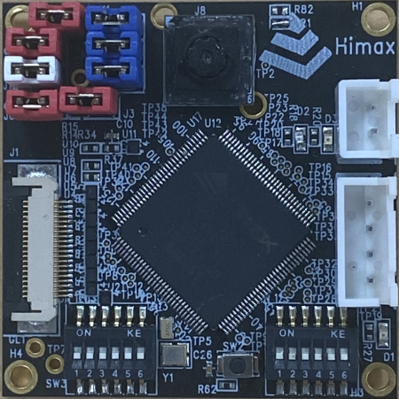
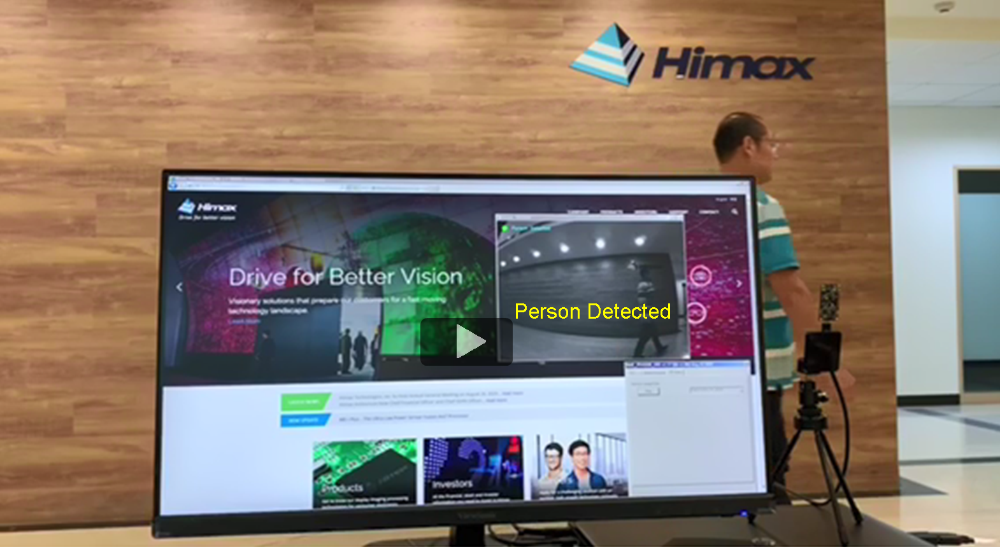

#   Power measuremnt of HIMAX WE-1 Plus   

As we know, endpoint AI applications are always-on and simultaneously aware and responsive to the local context. The optimization of inference time and power efficiency is very important for better user experience. In this document, power measurement of person detection will be introduced.

## 2.5mW VGA person detection on WE-I Plus

Person detected wakeup is commonly used in vision endpoint AI applications.
TensorFlow Lite for Microcontrollers provides a 250KB embedded vision model and Visual Wake Word, MSCOCO dataset for person detection training and deployment. More detail about person detection example can be found [here](https://github.com/tensorflow/tensorflow/tree/master/tensorflow/lite/micro/examples/person_detection_experimental#person-detection-example)

We deployed person detection model with Synopsys MLI optimized kernels on WE-I Plus development board with a `HM0360` VGA CCM. This board is designed for easy power measurement and provides some headers to connect with current meter.

The model inference time is `35ms`. The measured average power is just `2.5mW` per frame per second, including WE-I Plus ASIC and `HM0360` sensor.

