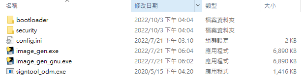
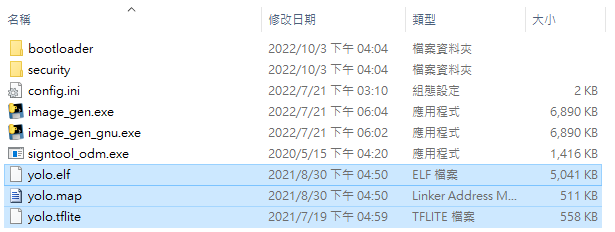
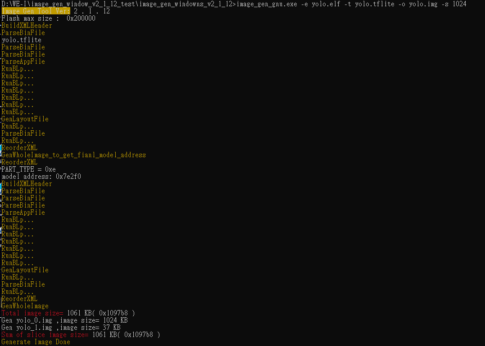

# Image gen tool Windows version v2.1.11 for HIMAX_WE1_EVB 
It is a command-line tool to generate image file for HIMAX_WE1_EVB. The tool has been built by python and tested in Windows 10 version 1909.

## Table of contents
  - [Image gen tool](#Image-gen-tool)
  - [Example](#Example)

## Image gen tool
- Image tool version: v2.1.11
- How to generate image file?
  - Use cmd to open image_gen_window_v2_1_11 folder. 
    - The folder will be like following image.
      
  - Put your own elf, tflite and map files which you made at first under image_gen_window_v2_1_11 folder.
      
  - GNU version
    - key-in following command on your cmd
      ```
      image_gen_gnu.exe -e yolo.elf -t yolo.tflite -o yolo.img -s 1024
      ```
    - -e: elf file name
    - -t: tflite file name (Optional: Depend on you want to put your tflite on flash or not)
    - -o: output image file name
    - -s: slice image size (we set each image file size less than 1024KB)
      
  - Metaware version
    - key-in following command on your cmd
      ```
      image_gen.exe -e yolo.elf -t yolo.tflite -m yolo.map -o yolo.img -s 1024
      ```
    - -e: elf file name
    - -t: tflite file name (Optional: Depend on you want to put your tflite on flash or not)
    - -m: map file name
    - -o: output image file name
    - -s: slice image size (we set each image file size less than 1024KB)

## Example
- GNU version to generate yolo image file
  - key-in following command on your cmd
      ```
      image_gen_gnu.exe -e yolo.elf -t yolo.tflite -o yolo.img -s 1024
      ```
      

  - You will generate output image files.
    

- Metaware version to generate yolo image file
  - key-in following command on your cmd
      ```
      image_gen.exe -e yolo.elf -t yolo.tflite -m yolo.map -o yolo.img -s 1024
      ```
      

  - You will generate output image files.
    


