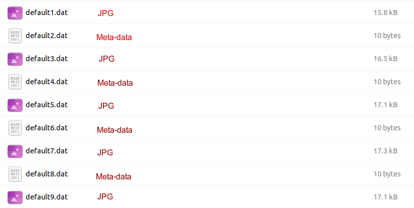
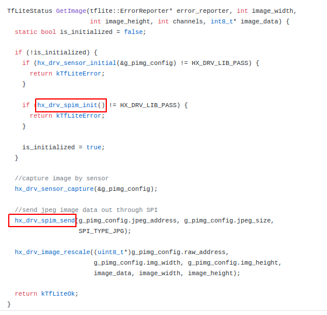

# SPI Tool for receive meta-data and images from HIMAX_WE1_EVB
It is a command-line tool for receive SPI data from HIMAX_WE1_EVB. The tool has been built by g++ and tested in Ubuntu 20.04 LTS environment.

source and one built version are placed in the directory.
  
## Table of contents
  - [Prerequisites](#prerequisites)
  - [Direct Use the built version tool](#direct-use-the-built-version-tool)
  - [How HIMAX WE1 EVB send data out via SPI](#how-himax-we1-evb-send-data-out-via-spi)
  - [build](#build)
  - [SPI protocol](#spi-protocol)
   
## Prerequisites
- C++ compiler
  
  To check if the compiler installed in your environment, 
      
  ```
  g++ --version
  ```

  the compiler can be installed by 

  ```
  sudo apt install g++
  sudo apt update
  sudo apt install build-essential
  ```

- FT4222 Linux driver
  1. Download FT4222 Linux driver [here](https://www.ftdichip.com/Support/SoftwareExamples/libft4222-linux-1.4.4.9.tgz).
  2. To install the FT4222 driver
    ```
    sudo ./install4222.sh
    ```
  3. Assign access right to a USB device, go to the directory 

    ```
    cd /etc/udev/rules.d/
    ```

    create a file with naming `99-ftdi.rules`, fill following data in the file

    ```
    # FTDI's ft4222 USB-I2C Adapter
    SUBSYSTEM=="usb", ATTRS{idVendor}=="0403", ATTRS{idProduct}=="601c", GROUP="plugdev", MODE="0666"
    ```

## Direct Use the built version tool
After prerequisites are checked, you can directly use the `WEI_SPIrecvImg` tool in the directory, remember to connect the USB cable.

In handwriting example, sensor images with JPG format and handwriting result as meta-data are sent through SPI interface. you can use this example to check if WEI_SPIrecvImg tool correctly receives the data.

1. follow the [steps](https://github.com/HimaxWiseEyePlus/himax_tflm#deploy-to-himax-we1-evb) to burn handwriting example into HIMAX_WE1_EVB
2. In Linux environment, type 
    ```
    ./WEI_SPIrecvImg 30
    ```
    to receive 30 data. It should be 15 images and 15 handwriting results, each data will be placed with filename 'default[no].dat'.



## How HIMAX WE1 EVB send data out via SPI

To use SPI, let's take Handwriting as an example, HIMAX_WE1_EVB will need to initial SPI first ` hx_drv_spim_init`. this initialization only needs to be done once. You can then use `hx_drv_spim_send` to send data.



To check more details, jpeg image out code [here](https://github.com/HimaxWiseEyePlus/himax_tflm/blob/master/examples/handwriting/himax_we1_evb/image_provider.cc) and meta-data code [here](https://github.com/HimaxWiseEyePlus/himax_tflm/blob/master/examples/handwriting/himax_we1_evb/detection_responder.cc)


## build

you can also build your tool from source by

```
/build_cmd.sh
```

the tool will be built via g++ with the filename `WEI_SPIrecvImg`

## SPI protocol 

when HIMAX_WE1_EVB sends data out via SPI, it will be placed with a header and data may be cut into packages based on the data length.


